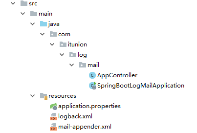
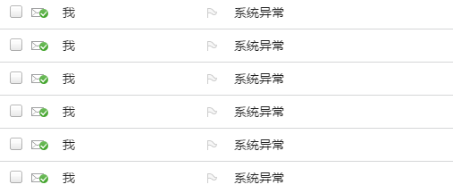
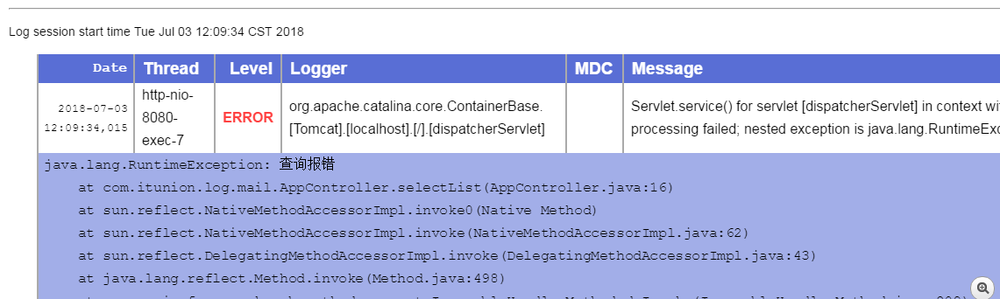

# Spring Boot Logback 邮件通知
日志对于应用程序来说是非常重要的，当你的程序报错了，而你又不知道是多么可怕的一件事情，本文使用logback把程序报错信息邮件到开发者

## 目录结构


## 项目依赖配置
pom.xml
```xml
<?xml version="1.0" encoding="UTF-8"?>
<project xmlns="http://maven.apache.org/POM/4.0.0" xmlns:xsi="http://www.w3.org/2001/XMLSchema-instance"
         xsi:schemaLocation="http://maven.apache.org/POM/4.0.0 http://maven.apache.org/xsd/maven-4.0.0.xsd">
    <modelVersion>4.0.0</modelVersion>

    <groupId>com.itunion</groupId>
    <artifactId>spring-boot-log-mail</artifactId>
    <version>0.0.1-SNAPSHOT</version>
    <packaging>jar</packaging>

    <name>spring-boot-log-mail</name>
    <description>Demo project for Spring Boot</description>

    <parent>
        <groupId>org.springframework.boot</groupId>
        <artifactId>spring-boot-starter-parent</artifactId>
        <version>2.0.3.RELEASE</version>
        <relativePath/> <!-- lookup parent from repository -->
    </parent>

    <properties>
        <project.build.sourceEncoding>UTF-8</project.build.sourceEncoding>
        <project.reporting.outputEncoding>UTF-8</project.reporting.outputEncoding>
        <java.version>1.8</java.version>
    </properties>

    <dependencies>
        <dependency>
            <groupId>org.springframework.boot</groupId>
            <artifactId>spring-boot-starter-web</artifactId>
        </dependency>

        <dependency>
            <groupId>org.springframework.boot</groupId>
            <artifactId>spring-boot-devtools</artifactId>
            <scope>runtime</scope>
        </dependency>
        <dependency>
            <groupId>org.springframework.boot</groupId>
            <artifactId>spring-boot-starter-test</artifactId>
            <scope>test</scope>
        </dependency>

        <!-- 邮件 -->
        <dependency>
            <groupId>org.springframework.boot</groupId>
            <artifactId>spring-boot-starter-mail</artifactId>
        </dependency>
    </dependencies>

    <build>
        <plugins>
            <plugin>
                <groupId>org.springframework.boot</groupId>
                <artifactId>spring-boot-maven-plugin</artifactId>
            </plugin>
        </plugins>
    </build>
</project>
```
这里主要使用了spring boot 邮件的依赖 spring-boot-starter-mail , 确实好方便

## 日志邮件配置
mail-appender.xml
```xml
<?xml version="1.0" encoding="UTF-8"?>
<included>

    <!--邮件设置-->
    <property name="smtpHost" value="smtp.163.com"/>
    <property name="smtpPort" value="25"/>
    <property name="mailFrom" value="xxx@163.com"/>
    <property name="username" value="xxx@163.com"/>
    <property name="mailTo" value="xxx@163.com"/>
    <property name="password" value="xxx"/>
    <property name="SSL" value="false"/>
    <property name="mailSubject" value="系统异常"/>

    <appender name="MAIL" class="ch.qos.logback.classic.net.SMTPAppender">
        <smtpHost>${smtpHost}</smtpHost>
        <smtpPort>${smtpPort}</smtpPort>
        <username>${username}</username>
        <password>${password}</password>
        <SSL>${SSL}</SSL>
        <asynchronousSending>false</asynchronousSending>
        <to>${mailTo}</to>
        <from>${mailFrom}</from>
        <subject>${mailSubject}</subject>
        <layout class="ch.qos.logback.classic.html.HTMLLayout"/>
        <filter class="ch.qos.logback.classic.filter.ThresholdFilter">
            <level>ERROR</level>
        </filter>
    </appender>

</included>
```

```xml
    <property name="mailFrom" value="xxx@163.com"/>
    <property name="username" value="xxx@163.com"/>
    <property name="mailTo" value="xxx@163.com"/>
    <property name="password" value="xxx"/>
```
这里需要把你自己的邮箱配置上去，并填上你的授权密码

> 邮箱记得打开 smtp 设置
> 邮箱记得打开 smtp 设置
> 邮箱记得打开 smtp 设置

## Logback 配置
logback.xml
```xml
<?xml version="1.0" encoding="UTF-8"?>
<configuration>

	<!-- 默认的一些设置 -->
	<include resource="org/springframework/boot/logging/logback/defaults.xml" />
	<!-- 日志文件变量 -->
	<property name="LOG_FILE" value="${LOG_FILE:-${LOG_PATH:-${LOG_TEMP:-${java.io.tmpdir:-/tmp}}}/spring.log}"/>
	<!-- 控台配置 -->
	<include resource="org/springframework/boot/logging/logback/console-appender.xml" />
	<!-- 文件配置 -->
	<include resource="org/springframework/boot/logging/logback/file-appender.xml" />
	<!-- 邮件配置 -->
	<include resource="mail-appender.xml" />

	<root level="INFO">
		<appender-ref ref="CONSOLE" />
		<appender-ref ref="FILE" />
		<appender-ref ref="MAIL"/>
	</root>
</configuration>
```
这里导入邮件配置文件 <include resource="mail-appender.xml" /> 和增加一行 <appender-ref ref="MAIL"/>


## 日志文件配置
application.properties
```java
logging.path=../logs
logging.file=../logs/file.log
logging.level.root=info

spring.http.encoding.charset=utf-8
```

## 模拟异常 AppController
```java
package com.itunion.log.mail;

import org.slf4j.Logger;
import org.slf4j.LoggerFactory;
import org.springframework.web.bind.annotation.ExceptionHandler;
import org.springframework.web.bind.annotation.RequestMapping;
import org.springframework.web.bind.annotation.ResponseBody;
import org.springframework.web.bind.annotation.RestController;

import java.util.Random;

@RequestMapping("/app")
@RestController
public class AppController {
    private Logger logger = LoggerFactory.getLogger(AppController.class);

    @RequestMapping
    public String selectList() {
        boolean flag = new Random().nextBoolean();
        if (flag) {
            throw new RuntimeException("查询报错");
        } else {
            return "正常返回 当前时间：" + System.currentTimeMillis();
        }
    }

    @ExceptionHandler
    @ResponseBody
    public String exceptionHandler(Exception e) {
        logger.error(e.getMessage(), e);
        return e.getMessage();
    }
}
```
这里模拟正式业务的异常触发，随机一个bool值，如果为真就抛出运行时异常
> 一般都会对异常统一处理，记得要使用  logger.error(e.getMessage(), e); 只是返回结果是不会发邮件的

## 启动并测试
访问 http://localhost:8080/app

要访问到页面显示"查询报错"

## 异常邮件截图


